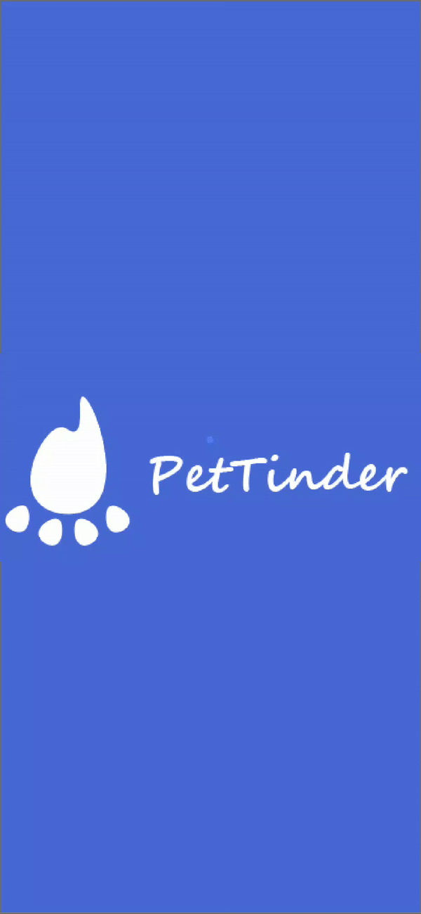

<h1 align="center">
  
     
</h1>

<h4 align="center">
     PeTTinder, an app to make dating for 
crossing Pets .

</h4>

 

  <a href="#rocket-built-with">Built with</a>&nbsp;&nbsp;&nbsp;|&nbsp;&nbsp;&nbsp;
  <a href="#information_source-how-to-run">How to run</a>&nbsp;&nbsp;&nbsp;|&nbsp;&nbsp;&nbsp;
  <a href="#page_facing_up-license">Licence</a>&nbsp;&nbsp;&nbsp;|&nbsp;&nbsp;&nbsp;
  <a href="#mailbox_with_mail-get-in-touch">Get in touch</a>

  

## :page_facing_up: License

This project is under the MIT license.

## :mailbox_with_mail: Get in touch!

[ LinkedIn ](https://www.linkedin.com/in/evoney-mendonça/)

email: maktheus@gmail.com

---

Made with :coffee: and ♥ by Uchôa.
